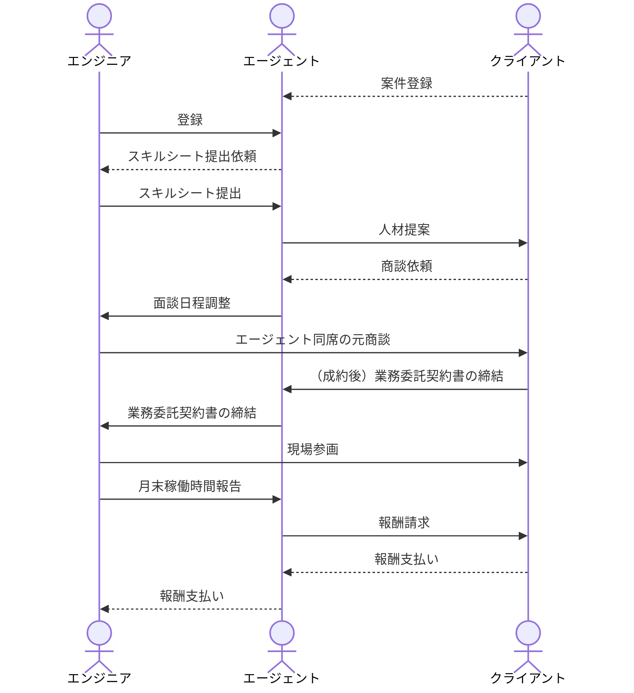
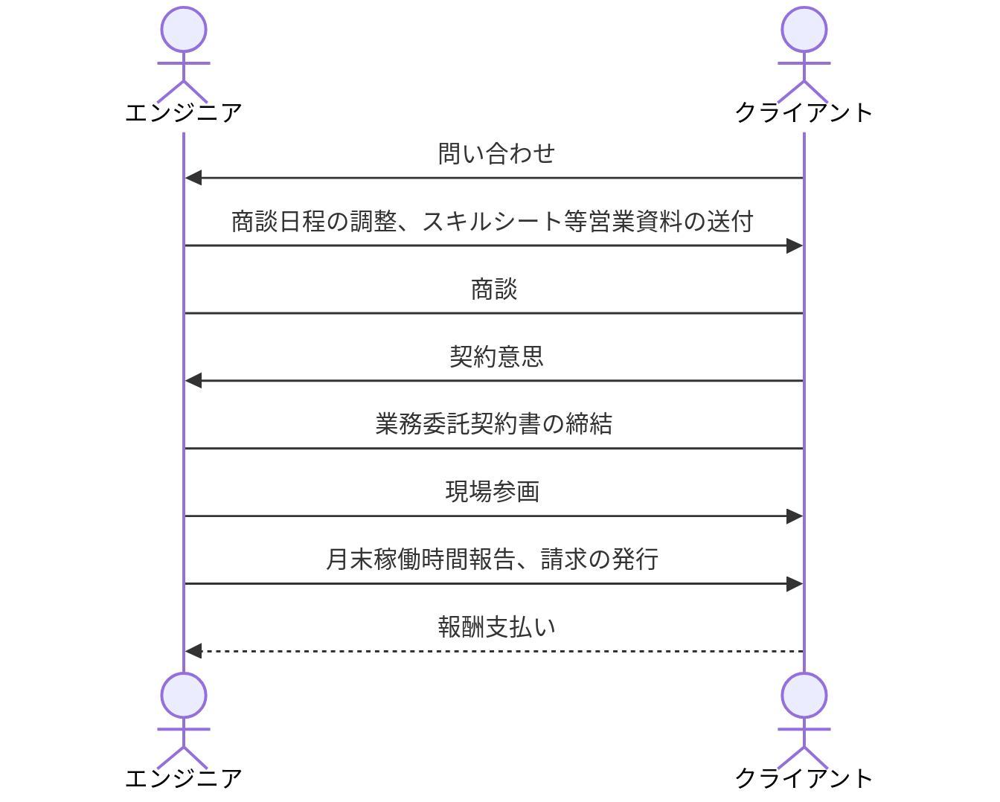

# 第６章: 案件受注から自分の口座への入金までの具体的な流れ

> 出典: [Notion - フリーランスエンジニア完全攻略バイブル(Version2)](https://app.notion.com/p/9da1c99fe1904f14954bb9af769defc1)

この章では、「案件獲得してから自分の口座に報酬が入金されるまでの具体的な流れ」について解説していきます。

## エージェントを使う場合の案件獲得〜入金までのフロー

エージェントを使う場合の案件受注から自分の口座にお金が入金されるまでの具体的な流れについて解説していきます。

<!-- TODO: 画像あり（Notion添付のスクリーンショット「スクリーンショット_2024-01-01_21.18.23.png」／署名付きS3 URLのため期限切れ。実体は本ファイル末尾「図 > エージェント利用」のシーケンス図と同内容: https://prod-files-secure.s3.us-west-2.amazonaws.com/06047213-3249-44e3-aa5d-e3f4b1c0b429/3dc85fc7-650f-4105-acb8-32658aab84a6/ ) -->

1. **フリーランスエージェントへ登録**
2. **職務経歴書の作成**
3. **エージェントとの面談・案件マッチング依頼**
4. **発注先とエージェント介した面談**
5. **参画決定、エージェントとの業務委託契約書締結**
6. **現場参画**
7. **月末、稼働時間精算。エージェントへの請求書提出**
8. **来月末入金**
9. **契約継続可否決定(契約更新1ヶ月前)**

順に見ていきましょう。

### 1.フリーランスエージェントへ登録

何はともあれ、案件を獲得するためにまずはエージェントへ登録しましょう。

流れている案件には「複数エージェントに一斉に流されている案件」と「エージェント固有の案件」の二つがあります。それぞれ**固有の案件情報にアクセスするためには複数のエージェントに登録**した方が良いです。

### 2.職務経歴書の作成

職務経歴書を作成します。エージェントから指定された様式で書くように指示されることもあります。

### 3.エージェントとの面談・案件マッチング依頼

2で作成した職務経歴書をもとにエージェントとの面談を行います。

**転職経験が何度かある方は転職エージェントとの面談をイメージ**するとわかりやすいと思います。

面談後、担当者がマッチしそうな案件を送ってくるか、あるいは登録者用の案件管理サイトから自分で応募します。

定期的にエージェントから送信されるメールマガジンからも案件応募が可能です。

### 4.発注先とエージェントを介した面談

発注先（実際に働くことになる現場）の担当と面談を行います。面談の設定などはエージェント側の担当者が行ってくれることが多いです。

**転職経験が何度かある方は転職の採用面接をイメージ**してください。正社員の採用面接と違う点としては、「発注先担当者一回の面談で案件参画可否が決まることが多い」点です。

### 5.参画決定・エージェントとの業務委託契約書締結

無事開発案件への参画が決まったら、エージェントとの業務委託契約書を締結します。

**契約としては あなた→エージェント→発注元 という契約**になり、直接の契約先としてはフリーランスエージェント会社との業務委託契約となることが多いです。（探せば直契約斡旋してくれるところもあります）

なので契約に関する相談（単価UPなど）は基本的にエージェントを通して行う形になります。

**注意点としては、必ず書面（あるいは電子書面）で契約を締結してください。また、契約書を必ず読んでからサインしてください。**

書面契約で、契約書をきちんと読むなんて当たり前のことだと思うかもしれませんが、「口約束で発注するとか言ったのにその後連絡が来ない」「契約書に2年間の瑕疵担保責任が入っており、現場離任後も対応を求められた」などというトラブルをよく耳にします。

もし、**自分では契約書の内容を理解できないというのであれば、お金を払って弁護士にリーガルチェック（契約書の内容が妥当かどうかをチェックしてもらうこと）を依頼**してください。

基本を徹底してください。**頭で理解するだけでなく、その通りに行動できてこそ「理解できている」と言える**のです。

### 6.現場参画

業務委託契約を締結したら、指定された日時から実際に現場に入ることになります。

エンジニアとしては「いつから入れるか」を伝えれば後の段取りは基本的にエージェントと発注元が行ってくれます。

また、企業の情報管理などの都合上PCは貸与されることが多いです（一部BYOD可なところもありますが）

諸々手続き完了したらいよいよ開発チームへジョインです。

前章でも述べましたが、**「現場の信用」を勝ち取るには最初の1ヶ月が勝負です。リモートワークに移行できるか？面白い仕事ができるか？単価UPを引き出すことができるか？稼働を減らしても契約を継続できるか？全てこの1ヶ月で決まると考え、初動から全力で価値提供に動いてください。**

### 7.月末、稼働時間精算。エージェントへの請求書提出

月末になったらその月の稼働時間を集計し、エージェントへの稼働実績表と請求書を提出します。

稼働実績表に関しては基本的にエージェントからテンプレートが渡されます。

エージェント経由の案件はほとんどが精算幅あり（ex. 140~180時間/月）だと思うので、この範囲に収まるように普段から動いていく必要があります。

一応稼働上限を超えている場合は割り増しで請求できると思いますが、あまり良い印象を与えませんので注意してください。（もちろん、正直ベースで稼働超過した場合にその対価としての報酬は受け取るべきですが）

### 8.翌月末入金

一部では入金が早いエージェントもありますが、**基本的には入金サイクルは「当月末締め、来月末払い」です**。

たとえば4月の稼働であれば4/30 に稼働時間精算、請求書提出。5/31 に支払いという流れになります。

なので一定期間、入金までタイムラグがあることを理解しておいてください。

### 9.契約継続可否決定（契約更新1ヶ月前）

契約継続可否の決定は通常、契約更新1ヶ月前（1ヶ月更新の場合二週間前くらい）で通知されます。

ただし、**契約書に書いていなければあくまでも紳士協定であって、自分は悪くないのに発注先の事業環境の変化で突然契約終了になるケースもある**ということは理解しておいてください。

**フリーランスの高い単価には、突然切られるリスク（発注側からしたら経営環境の変化で雇用の調整弁にできるメリット）が含まれています。そう言うものだと割り切って次を探しましょう。**

## 直契約の場合の案件獲得〜入金までのフロー

発注先企業との直接契約の場合は以下のようなフローになる場合が多いです。

<!-- TODO: 画像あり（Notion添付のスクリーンショット「スクリーンショット_2024-01-01_21.18.38.png」／署名付きS3 URLのため期限切れ。実体は本ファイル末尾「図 > 直契約」のシーケンス図と同内容: https://prod-files-secure.s3.us-west-2.amazonaws.com/06047213-3249-44e3-aa5d-e3f4b1c0b429/e7949644-4189-41cb-b997-995c8a929618/ ) -->

1. **リファラル、SNS、広告などからアポイントを獲得**
2. **発注者と直接面談**
3. **受注した場合、業務委託契約書の作成・締結**
4. **現場参画**
5. **月末、稼働時間精算。発注元へ請求書を送付**
6. **来月末振込**

エージェントを使う場合と比較して順に解説していきます。

### 1.リファラル、SNS、広告などからアポイントを獲得

まずはアポがないことには始まらないです。**エージェントの主な付加価値は「いつでも人を募集できるように、大量に案件リストを保有する」にありますが、直営業だと自分でそれを作らなければなりません。**

精神的にタフな人は開発案件持っていそうな会社をWebで探して片っ端から営業かけるでも良いですが、やはりリファラルなどの手法と比べて成約率は高くないです。

広告運用スキルやコンテンツ制作スキルがある人は広告やSNSからの問い合わせをメインにしても良いですが、**最も簡単なのは「かつて同じ現場で働いていた人から紹介を受ける」というリファラルルート**です。

フリーランスは会社員と比べて開発メンバーの入れ替わりが激しい傾向にありますが、**逆にいうとそれだけリファラルのチャンスが多い**ということです。

もちろん周りから実務面での評価をされていないとそもそも紹介してくれませんので、**「日々ちゃんと価値提供できているかどうか」が試されます。**

飛び込み営業したくない方こそ基本に立ち返り、仕事で成果を出すことを意識してください。

### 2.発注者と直接面談

アポイントが取れたら発注者と直接面談日程を組みます。

もちろんエージェントはいないので、**事前の職務経歴書の共有や細かい段取りなどは全てあなたがやる**ことになります。（慣れてくるとそれほど大変ではないですが）

zoomでも対面でも良いですが、**対面の方が成約率は高い**です。

エージェントを使う場合と同様、基本的に業務委託の案件獲得では面談一回で発注可否が決まります。

発注先によってはいつまでも回答しないパターンもあるので、**回答期限をこちらから切っておいた方が安定**します。（宙ぶらりんにされたまま並行営業もできない。。。というのが最悪のパターンなので避けたいです）

### 3.受注した場合、業務委託契約書の作成・締結

めでたく受注したら業務委託契約書の作成と締結を（電子）書面で行います。

ここで注意してほしいのが、発注先によっては契約条項に無茶な文言を突っ込んでくる場合があります。

**不利な条項が入っているケースはエージェント経由でもありえますが、エージェントというフィルタを通していないので、受注者に不利な条項が忍び込んでいるケースは直営業の方が多い傾向にあります。**

契約書は必ず一言一句目を通して、納得いく契約内容でのみ締結してください。内容が理解できない場合は、弁護士にリーガルチェックを依頼するなどの対応を自分の裁量で行なってください。

契約書の内容に不満がある場合は必ず担当者とコミュニケーションをして契約書を修正させてください。

**内容がまとまらない場合は「受注をお断りする」という決断もしなければならない場合もあります。**

「うちではこういう決まりだから」「こんな条項、形だけだから」と担当者が押し切ろうとしてくる場合がありますが、**いざトラブルになったときは「契約書に書いてあることが全て」です**。

双方納得できる契約の落とし所を探ってください。

### 4.現場参画

契約書を締結したら日程を決めて現場に入ります。

PCが貸与されるかどうかは現場によります。上場企業だと貸与されるケースが多いですが、Web系のベンチャーなどだと自分のPCで作業することも多いです。

**自分のPCで作業する場合は十分セキュリティに注意し、個人情報の漏洩などのインシデントを起こさない**ように努力してください。

**「初動であなたへの現場の信頼が概ね確定する」のはエージェント使う場合と同じです。リファラルでジョインした場合は特に紹介してくれた人のメンツを潰さないように全力で仕事してください。**

### 5.月末、稼働時間精算。発注元へ請求書を送付

月額契約の業務委託を前提とした場合は、月末に稼働時間を集計することは変わりません（契約によっては精算上限・精算下限がなく実稼働ベースの請求になるケースもあります。契約時に確認してください）

集計をしたら、発注元へ直接請求書を送付します。

### 6.翌月末入金

請求書が受理されれば、稼働月の来月末に口座にお金が振り込まれるはずです。

**なお、「稼働時間精算、来月末振込」というのは一般的な慣例の一つであって、双方合意できるのであればこれに必ずしも従う必要はありません。**

例えば**前金制にしたり、入金スパンを早めてもらったり、技術顧問のような形で隔週MTGで対価を請求するなども可能**です。

お互いにとってWin-Winになるような契約形態を探ってください。

## この章のまとめ

- エージェント利用の場合と直契約の場合の流れを理解しておく
- 契約書大事。必ず書面で締結すること

---

## 図

### エージェント利用

### 直契約

